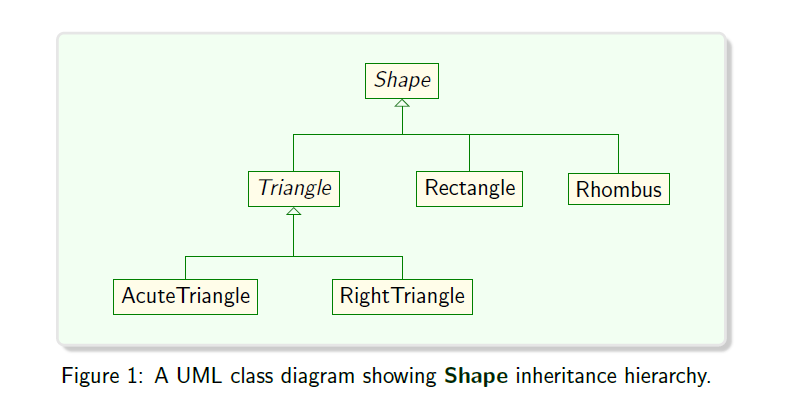

# Slot-Machine-Modeling-Geometric-Shapes
A class that models a simple slot machine, using the geometric shapes created as the visual symbols on the reels. The slot machine is to have three reels, each with 4 symbols (shapes), and each symbol in 25 available sizes.

 Each geometric shape is represented by a class.
 
 # Class Hierarchy UML Diagram
 
 
 
 **Shape**  and **Triangle** are **abstract classes** since they model shapes that are general.
 
 **Rectangle**, **Rhombus**, **RightTriangle**, **AcuteTriangle** represent **concrete shape classes** as they can be textually rendered into visually identifiable patterns.
 
 The project demonstrates the concepts of **OOPS** that is **Abstraction, Encapsulation, Information Hiding, Inheritance and Polymorphism**.
 
 The project also uses **C++ Smart Pointers** to represent the shapes in the 3 reels of the Slot Machine. It automatically deletes the current shape object and resets it to a new dynamically allocated Shape Object.
 
 
 
 
